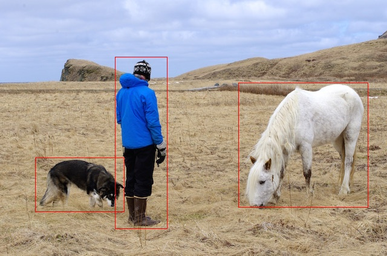

# libtorch1.6-yolov3
A Libtorch implementation of the YOLO v3 object detection algorithm, written with pure C++, modified from [https://github.com/walktree/libtorch-yolov3](https://github.com/walktree/libtorch-yolov3). 

It can be seen the changes in issue: [https://github.com/walktree/libtorch-yolov3/issues/52#issue-686915754](https://github.com/walktree/libtorch-yolov3/issues/52#issue-686915754) 

I have successfully tested in Win10 using Visual Studio 2017.

## Requirements
1. [LibTorch v1.6.0](https://pytorch.org/cppdocs/installing.html)

    Add `"${LIBTORCH}/lib"` to system path.
2. CUDA(Optional)
3. [OpenCV4.4](https://github.com/opencv/opencv/releases/tag/4.4.0) (Sugest using windows pre-build package)
    
    Add `opencv/x64/vc15/bin` to Windows system PATH
4. `Git Bash` or `Cmder`

## To compile
1. Cmake3.15
2. Visual Studio 2017 (VC 15)


```
$ mkdir build && cd build
$ cmake -G "Visual Studio 15 2017 Win64" -T host=x64 -DCMAKE_PREFIX_PATH="your libtorch root" -DOpenCV_DIR="your opencv root" ..
$ cmake --build . --config Release -j 3
```
`your libtorch root` is like `E:\python\pytorch\libtorch` and `your opencv root` is like `"E:\ScientificComputing\opencv\build"`(which has `OpenCVConfig.cmake` file). Finally `libtorch1.6-yolov3\build\Release\yolo-app.exe` is generated.

## Running the detector

The first thing you need to do is to get the weights file for v3:

```
cd models
wget https://pjreddie.com/media/files/yolov3.weights 
```
By default, the program will load yolov3 cfg and weights in `model` directory. It can be changed manually in `main.cpp` in line 32 and line 39 (Don't forget to recompile!).

Copy all `.dll` file from `libtorch/lib` to `libtorch1.6-yolov3/build`, then open `git bash`  or `cmder` and execute:
```
$ cd libtorch1.6-yolov3/build
$ ./Release/yolo-app.exe ../imgs/person.jpg
```
The result is:
```
loading weight ...
weight loaded ...
start to inference ...
inference taken : 980 ms
3 objects found
Done
```


If you encounted some errors like `error while loading shared libraries: torch.dll: cannot open shared object file: No such file or directory`, be sure that you have put the `libtorch/lib` in your system path, or you can copy the dependent file to the same directory as `yolo-app.exe` is in.